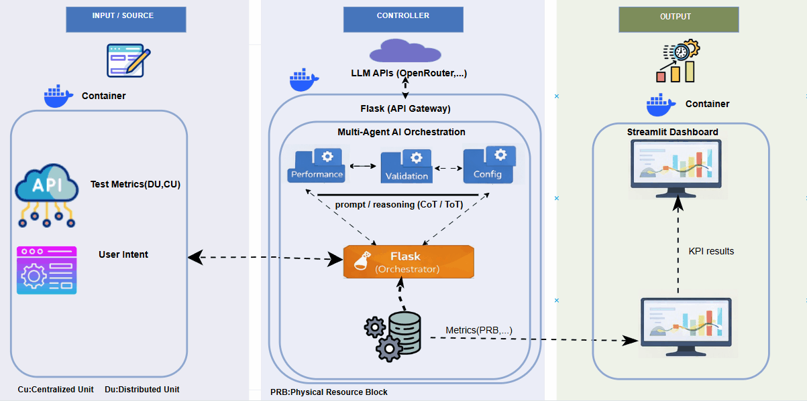

# O-RAN Agentic Resource Allocation

This work investigates intelligent resource allocation using an agent-based model
in the Distributed Unit (DU) and the Centralized Unit (CU)
within O-RAN architectures. A LangGraph-based control layer is
integrated into the SMO to support human-in-the-loop decision-making.

## Architecture

## Scenario 1 – DU Resource Allocation

## 📂 Project Structure

oran-agentic-resource-allocation/

├── agents/               # Autonomous agent logic for resource allocation tasks

├── api/                  # REST API endpoints and business logic

├── frontend/             # Frontend application (React/Vue/etc.)

├── images/               # Static assets, diagrams, and visual resources

├── init.sql              # Initial SQL script for database setup

├── llm/                  # Large Language Model integration and utilities

├── mock/                 # Mock data and testing utilities

├── postgres/             # PostgreSQL database configurations and scripts

├── smo/                  # System management and orchestration modules

├── .env                  # Environment variables (not tracked by Git)

├── .gitignore            # Files and folders ignored by Git

├── docker-compose.yml    # Docker container orchestration configuration

└── README.md             # Project documentation

### The evaluation of the agent's results is performed using the following

resource allocation and RAN performance KPIs:

- RRC Connection Establishment Success Rate
- Physical Resource Block (PRB) Usage
- OR.CellU.ActDeactMacCeScellDeact (SCell activation/deactivation counter)
- MCS(Modulation and Coding Scheme Key)