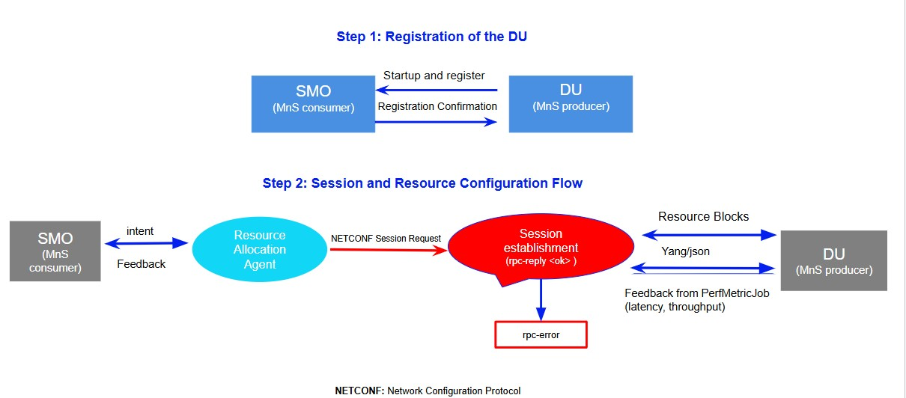

# O-RAN Agentic Resource Allocation

This work investigates intelligent resource allocation using an agent-based model
in the Distributed Unit (DU) and the Centralized Unit (CU)
within O-RAN architectures. A LangGraph-based control layer is
integrated into the SMO to support human-in-the-loop decision-making.

## Architecture


## Scenario 1 – DU Resource Allocation


## Project Structure
```
oran-agentic-resource-allocation/
├── agents/
├── api/
├── frontend/
├── images/
├── init.sql
├── llm/
├── mock/
├── postgres/
├── smo/
├── .env
├── .gitignore
└── docker-compose.yml
└── README.md
```

### The evaluation of the agent's results is performed using the following

resource allocation and RAN performance KPIs:

- RRC Connection Establishment Success Rate
- Physical Resource Block (PRB) Usage
- OR.CellU.ActDeactMacCeScellDeact (SCell activation/deactivation counter)
- MCS(Modulation and Coding Scheme Key)