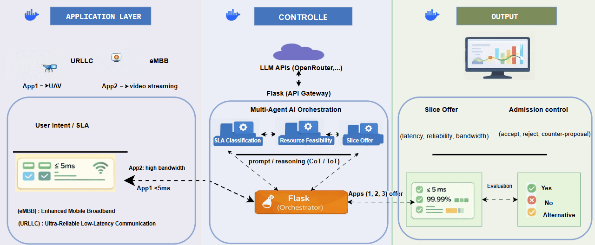
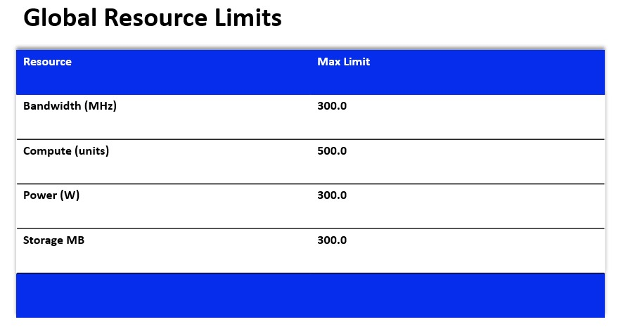
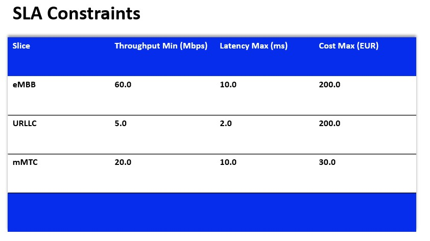
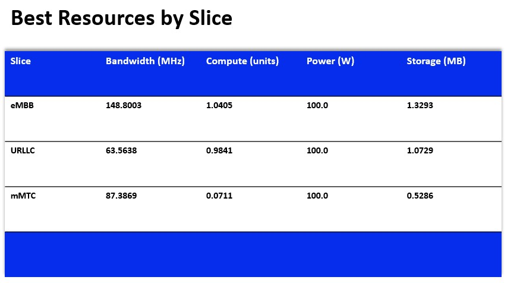
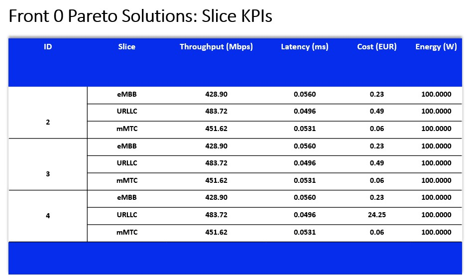

# O-RAN Agentic Resource Allocation

This work investigates intelligent resource allocation using an agent-based model
in the Distributed Unit (DU) and the Centralized Unit (CU)
within O-RAN architectures. A LangGraph-based control layer is
integrated into the SMO to support human-in-the-loop decision-making.

## Architecture



## 📂 Project Structure

```text
oran-agentic-resource-allocation/
├── agents/               # Autonomous agent logic for resource allocation tasks
├── api/                  # REST API endpoints and logic (Flask)
├── frontend/             # Frontend
├── images/               # Static assets, diagrams, and visual resources
├── init.sql              # Initial SQL script for database setup
├── llm/                  # Large Language Model integration
├── mock/                 # Mock data and testing
├── postgres/             # PostgreSQL database configurations and scripts
├── smo/                  # System management and orchestration
├── .env                  # Environment variables 
├── .gitignore            
├── docker-compose.yml    # Docker container orchestration configuration
└── README.md             
```

## NSGA-II Baseline for Multi-Objective Optimization

This project uses the Non-Dominated Sorting Genetic Algorithm II (NSGA-II) as a baseline method to solve a multi-objective resource allocation problem in O-RAN network slicing.

The optimization jointly considers four conflicting objectives:

 maximize total throughput
- minimize total latency
- minimize total cost
- minimize total energy consumption

Each candidate solution represents slice-level resource allocations for:
- bandwidth
- compute
- power
- storage

The considered slice types are:
- eMBB: Enhanced Mobile Broadband, focused on high data-rate services
- URLLC: Ultra-Reliable Low-Latency Communications, focused on delay-sensitive and highly reliable services
- mMTC: Massive Machine Type Communications, focused on large-scale IoT connectivity

### Implementation

This project uses [PyGAD](https://pygad.readthedocs.io/) version `3.2.0` to implement NSGA-II for multi-objective optimization.
- PyGAD documentation: [pygad.readthedocs.io](https://pygad.readthedocs.io/)
- PyGAD repository: [ahmedfgad/GeneticAlgorithmPython](https://github.com/ahmedfgad/GeneticAlgorithmPython)
- PyGAD 3.2.0 release notes: [PyGAD-3.2.0](https://pygad.readthedocs.io/en/latest/pygad_more.html#save-solutions)

!-- ## NSGA-II 

The following figures show preliminary NSGA-II results based on global resource limits and phase KPI constraints. User-specific requirements are not yet included in the optimization loop.
<!-- 
 



 Full JSON output: [nsga2_result.json](results/baseline/nsga2_result.json)
 PowerPoint presentation: [NSGA-II_Baseline.pptx](slides/NSGA-II_Baseline.pptx) -->

- [Global Resource Limits](images/Global_Resource_Limit.jpg)
- [SLA Constraints](images/SLA_Constraints.jpg) 
- [Best Resources by Slice](images/Best_Resources_by_Slice.jpg)
- [KPIs of Best Solution](images/KPIs_of_Best_Solution)
- [Front 0 Pareto Solutionsn](images/Front_0_Pareto_Solutions_Slice_KPIs.jpg)
- Full JSON output: [nsga2_result.json](results/baseline/nsga2_result.json)
<!-- - PowerPoint presentation: [NSGA-II_Baseline.pptx](slides/NSGA-II_Baseline.pptx) -->

## Scenario 1 – DU Resource Allocation

### The evaluation of the agent's results is performed using the following

resource allocation and RAN performance KPIs:

- RRC Connection Establishment Success Rate
- Physical Resource Block (PRB) Usage
- OR.CellU.ActDeactMacCeScellDeact (SCell activation/deactivation counter)
- MCS(Modulation and Coding Scheme Key)